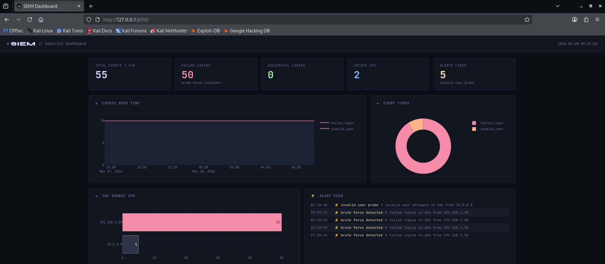
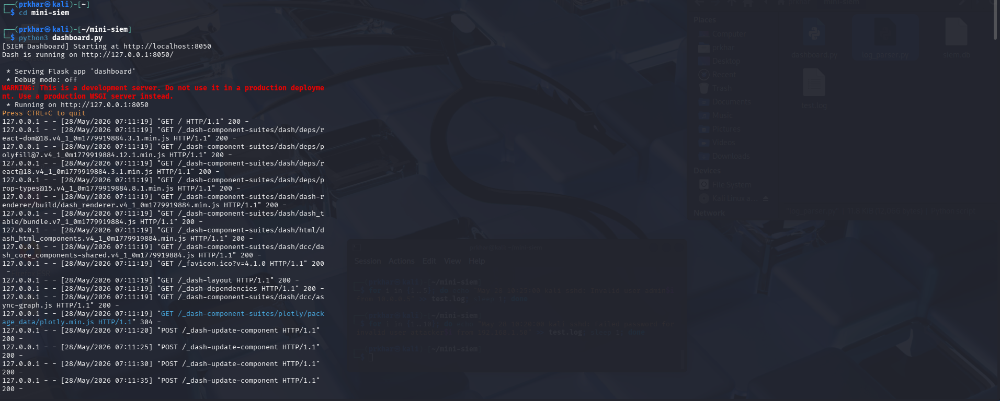
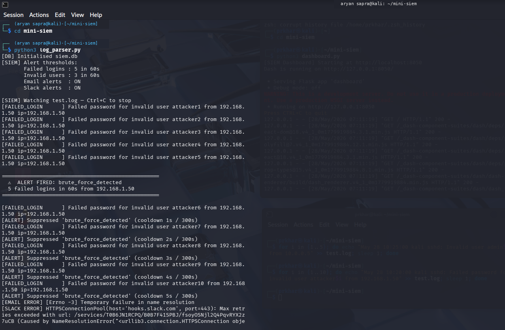
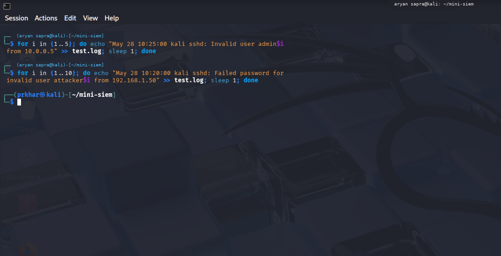

# Real-Time Mini SIEM 🔐

A lightweight **Security Information and Event Management (SIEM)** platform built with Python, SQLite, Dash, and Plotly for real-time Linux/SSH log monitoring, security-event detection, correlation, alerting, and SOC-style investigation.

> **Portfolio focus:** SIEM fundamentals, detection engineering, authentication telemetry, source-IP correlation, alert triage, MITRE ATT&CK mapping, and secure configuration.

---

## 🚀 What This Project Does

This project turns raw SSH/syslog-style authentication events into actionable security alerts:

```text
Raw Log
   ↓
Parse & Normalize
   ↓
Extract Source IP / Username
   ↓
Enrich Event
   ↓
Sliding-Window Correlation
   ↓
Detection Rules
   ↓
Severity + MITRE ATT&CK Mapping
   ↓
SQLite Persistence
   ↓
Console / Slack / Email Alert
   ↓
Live SOC Dashboard
```

The goal is to demonstrate the core workflow used by a small security monitoring pipeline rather than only displaying log data.

---

## ✨ Key Features

### 🔍 Detection Engineering

- **Brute-force detection** using failed-login thresholds per source IP
- **Password spraying detection** based on multiple usernames targeted by the same source IP
- **Invalid-user / account enumeration detection**
- **Privileged-account targeting detection** for accounts such as `root`, `admin`, and `administrator`
- **Failed → successful login correlation** to surface potentially successful compromise attempts
- **Sliding-window correlation** for time-based behavioral detection
- **Alert cooldown / deduplication** to reduce repeated notifications
- **MITRE ATT&CK technique mapping** on security alerts

### 🛡️ Security Engineering

- Source IP extraction and validation with Python `ipaddress`
- Username extraction from SSH authentication messages
- Severity classification for monitored events
- Environment-variable based configuration
- No credentials hard-coded in application code
- `.env` excluded from version control
- SQLite persistence for logs and alerts
- Bounded in-memory correlation queues to prevent unbounded growth
- Graceful handling of malformed/unrecognized log lines

### 📊 SOC Dashboard

- Live auto-refreshing dashboard
- Total events and failed-login KPIs
- Unique source-IP tracking
- High / critical alert overview
- Event timeline
- Event-type distribution
- Top source IPs
- Live alert feed
- Live log tail
- Dark SOC-style interface

### 📣 Alerting

- Console alerts for local monitoring
- Slack Incoming Webhook integration
- SMTP email integration
- Alert messages include severity, source IP, detection type, and MITRE ATT&CK information where available

---

## 🎯 Detection Rules

| Detection | Trigger | Severity | MITRE ATT&CK |
|---|---|---:|---|
| Brute Force | 5+ failed SSH logins from one IP within 60 seconds | **High** | T1110.001 — Password Guessing |
| Invalid User Probe | 3+ invalid-user attempts from one IP within 60 seconds | **Medium** | T1087.001 — Local Account |
| Password Spraying | 4+ distinct usernames targeted by one IP within 60 seconds | **High** | T1110.003 — Password Spraying |
| Privileged Account Targeted | Authentication attempt targets a high-value account such as `root` or `admin` | **High** | T1078 — Valid Accounts |
| Success After Failures | Successful login occurs after recent failed attempts from the same IP | **Critical** | T1078 — Valid Accounts |

> Detection thresholds and alert cooldowns are configurable through environment variables.

---

## 🏗️ Architecture

```text
                 ┌──────────────────────────┐
                 │ Linux / SSH-style Logs    │
                 │ auth / syslog telemetry   │
                 └────────────┬─────────────┘
                              │
                              ▼
                 ┌──────────────────────────┐
                 │ Log Parser & Normalizer   │
                 │                            │
                 │ • Parse event             │
                 │ • Extract IP              │
                 │ • Extract username        │
                 │ • Classify severity       │
                 └────────────┬─────────────┘
                              │
                              ▼
                 ┌──────────────────────────┐
                 │ Detection / Correlation  │
                 │                            │
                 │ • Sliding windows        │
                 │ • Per-IP correlation      │
                 │ • Detection rules         │
                 │ • Alert cooldown          │
                 │ • ATT&CK mapping         │
                 └────────────┬─────────────┘
                              │
                   ┌──────────┴──────────┐
                   ▼                     ▼
        ┌───────────────────┐   ┌──────────────────┐
        │ SQLite            │   │ Alert Channels   │
        │                   │   │                  │
        │ logs              │   │ Console          │
        │ alerts            │   │ Slack            │
        │ investigation     │   │ SMTP             │
        └─────────┬─────────┘   └──────────────────┘
                  │
                  ▼
        ┌──────────────────────┐
        │ Dash + Plotly       │
        │ SOC Dashboard       │
        └──────────────────────┘
```

---

## 🧰 Tech Stack

| Area | Technology |
|---|---|
| Language | Python |
| Log processing | Regex + Python standard library |
| Correlation | Python `deque` / sliding windows |
| IP validation | `ipaddress` |
| Database | SQLite |
| Dashboard | Dash |
| Visualization | Plotly |
| Data handling | Pandas |
| HTTP alerting | Requests + Slack Webhooks |
| Email alerting | SMTP / Gmail |
| Testing | Python `unittest` |

---

## 📁 Project Structure

```text
Real-time-mini-siem-project-main/
│
├── dashboard.py                 # Dash-based SOC dashboard
├── log_parser.py                # Log parsing, correlation & alerting engine
├── simulate_attack.py           # Safe local synthetic event generator
├── requirements.txt
├── .env.example                 # Configuration template
├── .gitignore
├── SECURITY.md                  # Responsible-use & secret-handling notes
├── LICENSE
│
├── tests/
│   └── test_detection.py        # Detection/unit tests
│
├── screenshots/
│   ├── dashboard1.png
│   ├── dashboard2.png
│   ├── dashboard-working.png
│   ├── log-parser-working.png
│   └── testing.png
│
└── REAL_TIME_MINI_SIEM_Project_Report.pdf
```

---

## 🖥️ Dashboard Preview

### SOC Dashboard



### Live Dashboard / Monitoring



### Log Parser



### Detection Testing



---

## ⚙️ Installation

### 1. Clone the repository

```bash
git clone https://github.com/<YOUR_USERNAME>/real-time-mini-siem.git
cd real-time-mini-siem
```

### 2. Create a virtual environment

**Windows PowerShell**

```powershell
python -m venv .venv
.venv\Scripts\Activate.ps1
```

**macOS / Linux**

```bash
python3 -m venv .venv
source .venv/bin/activate
```

### 3. Install dependencies

```bash
pip install -r requirements.txt
```

### 4. Configure environment variables

Copy the example configuration:

**macOS / Linux**

```bash
cp .env.example .env
```

**Windows PowerShell**

```powershell
Copy-Item .env.example .env
```

By default, Slack and email alerting are disabled, so the project can run locally without external credentials.

> **Never commit `.env` or any passwords, API keys, tokens, webhooks, or private keys.**

---

## ▶️ Running the Project

### Terminal 1 — Start the SIEM collector

```bash
python log_parser.py
```

The parser tails the configured log file, parses new events, stores them in SQLite, and evaluates detection rules.

### Terminal 2 — Start the dashboard

```bash
python dashboard.py
```

Open:

```text
http://127.0.0.1:8050
```

---

## 🧪 Safe Attack Simulation

The repository includes a **local synthetic event generator** for demonstrating detections without attacking a real system.

Run:

```bash
python simulate_attack.py
```

The simulator writes synthetic SSH events such as failed logins followed by a successful login from the same source IP.

Expected detection flow:

```text
Multiple failed logins
        │
        ▼
Brute Force Detection → HIGH

Multiple usernames from one IP
        │
        ▼
Password Spraying → HIGH

Successful login after failures
        │
        ▼
Post-failure Success → CRITICAL
```

This is designed for a controlled local lab/demo environment.

---

## 🔔 Slack & Email Alerts

### Slack

Set the following values in `.env`:

```text
SLACK_ENABLED=true
SLACK_WEBHOOK_URL=<your-slack-webhook>
```

The SIEM posts real-time detection alerts to the configured Slack channel.

### Email

Configure SMTP settings:

```text
EMAIL_ENABLED=true
SMTP_HOST=smtp.gmail.com
SMTP_PORT=587
SMTP_USER=<your-email>
SMTP_PASSWORD=<your-app-password>
ALERT_RECIPIENT=<recipient-email>
```

For Gmail, use an **App Password** rather than your normal account password.

---

## 🔧 Configuration

Detection behavior can be tuned without modifying Python source code:

```text
FAILED_LOGIN_THRESHOLD=5
FAILED_LOGIN_WINDOW_SECS=60

INVALID_USER_THRESHOLD=3
INVALID_USER_WINDOW_SECS=60

UNIQUE_USER_THRESHOLD=4
UNIQUE_USER_WINDOW_SECS=60

CORRELATION_WINDOW_SECS=180
ALERT_COOLDOWN_SECS=300
```

Optional runtime paths:

```text
SIEM_DB=siem.db
SIEM_LOG_FILE=test.log
```

This makes the detection profile easy to adapt for different lab scenarios.

---

## ✅ Testing

Run the automated tests with:

```bash
python -m unittest discover -s tests -v
```

The test suite currently covers:

- IP extraction and validation
- Username extraction
- Privileged-account classification
- Source-IP-specific brute-force correlation
- SQLite-backed alert persistence used by the detection engine

---

## 🔐 Security Considerations

This project is intentionally designed as a **local defensive security lab**.

Use it only with systems and logs you are authorized to monitor.

Security practices included in the repository:

- Secrets are supplied through environment variables
- `.env` is excluded from Git
- No real network attack functionality is included
- Synthetic security events are generated locally for testing
- Malformed IP values are discarded during normalization
- Correlation state is bounded with `deque`

See [`SECURITY.md`](SECURITY.md) for additional responsible-use notes.

---

## 📌 Current Scope

This is a **mini-SIEM / detection-engineering project**, not a full enterprise SIEM replacement.

The current implementation focuses on:

- SSH/authentication telemetry
- Local file-based log ingestion
- Python-based correlation
- SQLite storage
- Rule-based detections
- Basic alert delivery
- SOC-style visualization

---

## 🛣️ Future Enhancements

Potential next steps for evolving the project toward a larger security platform:

- Elasticsearch / OpenSearch storage
- Multi-host log ingestion
- Threat-intelligence enrichment
- IOC reputation checks
- Geo-IP enrichment
- More Linux and web authentication detections
- Authentication and RBAC for the dashboard
- Dockerized deployment
- Streaming/event-queue based ingestion
- Machine-learning anomaly detection
- Detection rule configuration through the UI
- Long-term alert analytics and incident history

---

## 📄 Documentation

A detailed project report is included in:

[`REAL_TIME_MINI_SIEM_Project_Report.pdf`](REAL_TIME_MINI_SIEM_Project_Report.pdf)

---

## 👨‍💻 Author

**Your Name**  
Security / Backend Engineering Portfolio Project

---

## ⭐ Why This Project

This project demonstrates practical understanding of how a security monitoring pipeline can be built end-to-end:

**Telemetry → Parsing → Normalization → Correlation → Detection → Severity → ATT&CK Mapping → Alerting → Investigation**

It is intended to showcase hands-on **Python, Linux authentication logs, SIEM concepts, detection engineering, event correlation, and SOC workflows**.

---

## 📜 License

See [`LICENSE`](LICENSE).
